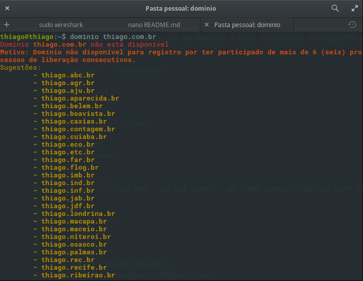

# dominios [](https://www.npmjs.com/package/dominio) [](https://travis-ci.org/thiagopaiva99/dominios)

> Verifique a situaçao atual um dominio X no registro.br

## Como instalar

```console
npm install -g dominio
```

## Como usar

```sh
$ dominio <dominio>
$ dominio thiago.com.br
```



## Licença

Este projeto tem uma licença MIT, por que nos <3 open source
